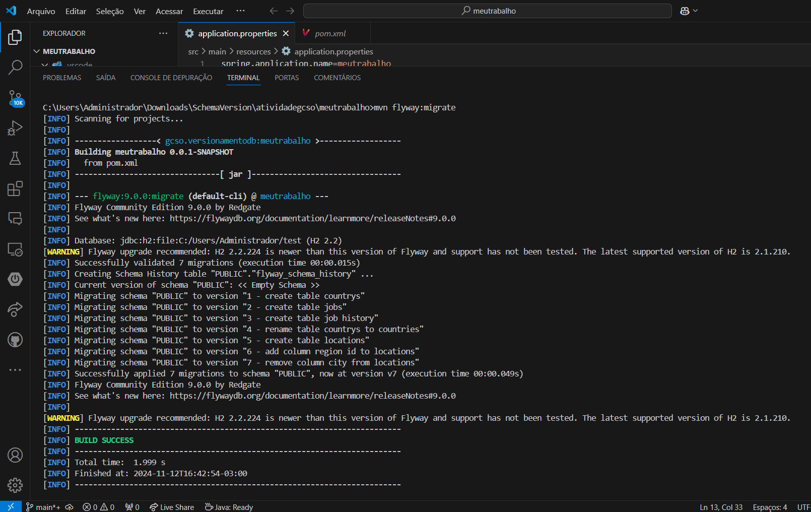
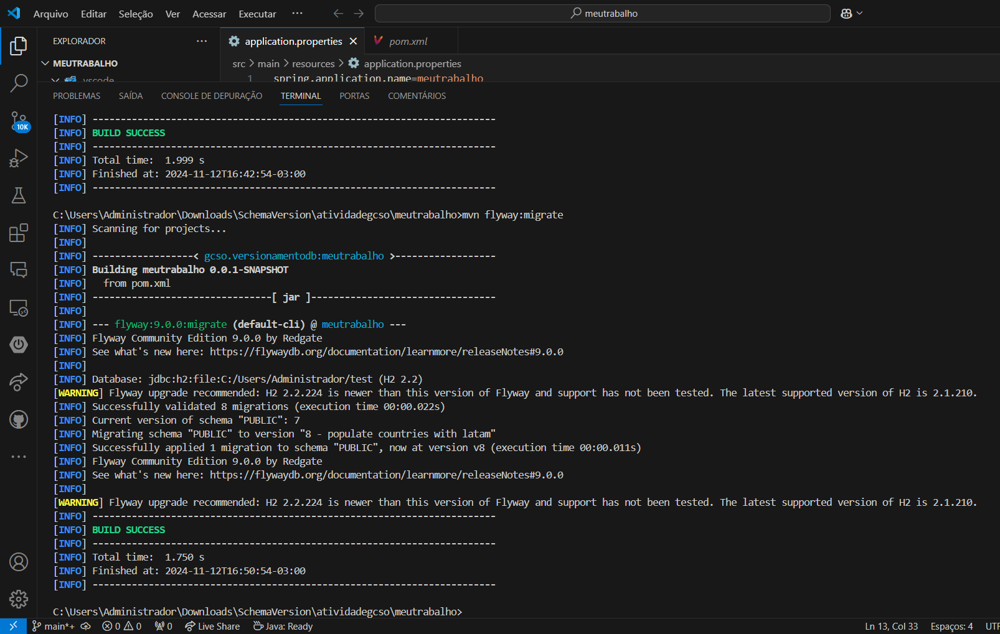
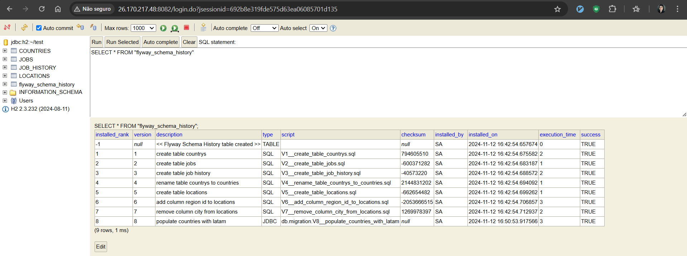
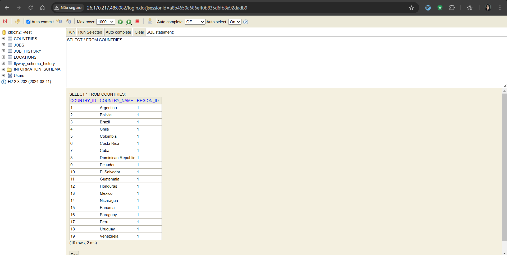

# GERENCIAMENTO DE CONFIGURAÇÃO DE SOFTWARE [GCSO] - 144-8AN (2024-2)

Versionamento do banco de dados H2 utilizando Flyway e Springboot 3.3.5 com Java JDK 17

### Demonstrativo de algumas telas desse sistema

1. Captura de tela do versionamento com SQL

2. Captura de tela do versionamento com Java

3. Captura de tela da tabela flyway_schema_history do banco de dados H2

4. Captura de tela da tabela COUNTRIES do banco de dados H2

